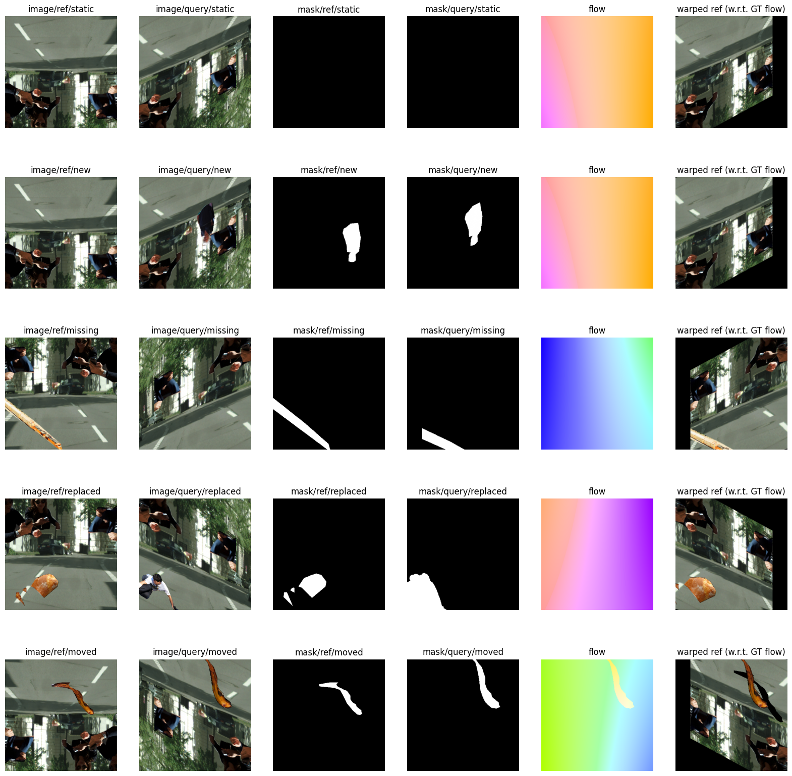

# SimSaC
Simultaneous scene flow estimation and change detection.
This is the official implementation of our paper: Dual Task Learning by Leveraging Both Dense Correspondence and Mis-Correspondence for Robust Change Detection With Imperfect Matches (CVPR2022).


## Recent Updates (Under construction)
- [x] Imperfect match download links (March 28, 2022)
- [x] A synthetic dataset generation script (March 31, 2022)
- [ ] Training & evaluation scripts 
- [ ] A demo script
 
## Getting Started

These instructions will get you a copy of the project up and running on your local machine for development and testing purposes.

### Requirements

* CUDA = 11.1
* Python 3.7
* Pytorch 1.9.1

### Installation

We tested the code with CUDA 11.1 on Ubuntu 20.04. SimSaC may work in other envionments.

1. Install requirements

```bash
pip install -r requirements.txt
```
2. Install cupy (Modify the CUDA version listed below to suit your environment).

```bash
pip install cupy-cuda111 --no-cache-dir
```
## Pretrained models

Download the following pretrained model and place it under the root directory.
- [pretrained_models](TBU)


## Data Preparation
### Generation of Synthetic Change Detection Dataset
We use a combination of COCO, DPED, CityScapes, and ADE-20K datasets, where objects in COCO are used as foregrounds and where images from DPED, CityScapes, and ADE-20K datasets are used as backgrounds. For the flow and background generation of ref. and query, we used the synthetic flow dataset generation code from [GLU-Net](https://github.com/PruneTruong/GLU-Net) resulting in 40,000 pairs. For the change mask foreground generation, we utilize Copy-Paste from [Copy-paste-aug](https://github.com/conradry/copy-paste-aug). We create 5 change detection pairs for each background pair, resulting in a total of 200,000 pairs.

Download and put all the datasets (DPED, CityScapes, ADE-20K, COCO) in the same directory. The directory should be organized as follows:
```bash
/source_datasets/
        original_images/
        CityScape/
        CityScape_extra/
        ADEChallengeData2016/
        coco/
```
To generate the synthetic change detection dataset and save it to disk:
```bash
python save_change_training_dataset_to_disk.py --save_dir synthetic
```

It will create the image pairs, flow fields, and change masks in save_dir/images, save_dir/flow, save_dir/mask respectively.
The process can take a day or more, because the copy-paste is time consuming. Add ```--plot True``` to plot the generated samples as follows:



### Downloadable Change Detection Datasets
- Download the [ChangeSim Dataset](https://github.com/SAMMiCA/ChangeSim)
- Download the [VL-CMU-CD Dataset](https://drive.google.com/file/d/0B-IG2NONFdciOWY5QkQ3OUgwejQ/view?resourcekey=0-rEzCjPFmDFjt4UMWamV4Eg)
- Download the [PCD Dataset](https://github.com/kensakurada/sscdnet) (You need to contact the author of PCD for the access of the augmented PCD)

Download and put all the datasets in the same directory. The directory should be organized as follows: 
```bash
/datasets/
        ChangeSim/
              Query_Seq_Train/
              Query_Seq_Test/ 
        VL-CMU-CD/
        pcd_5cv/
```

### Imperfect Matches
 - Download the [imperfect matches](https://drive.google.com/file/d/19ZR1-d6o2pgcwlH20Z-OFGwxYdd_Wkzq/view?usp=sharing) and put all the txt files in the same directory named ```imperfect_matches```. 
 - Each line of the txt files represents a sample, in the format of reference image path, query image path, ground-truth path, and match validity (1 or 0).

## Training & Evaluation

Run the following command to train the model on both synthetic and changesim.

```bash
python train.py \
--pretrained "" \
--n_threads 4 --split_ratio 0.90 --split2_ratio 0.5 \
--trainset_list synthetic changesim_normal \
--testset_list changesim_dust \
--lr 0.0002 --n_epoch 25 \
--test_interval 10
--plot_interval 10
--name_exp joint_synthetic_changesim
```
Here, the model is evaluated every 10-th epochs and the results are visualized every 10-th batches of the evaluation.


For more results, see [results](fig/results.md).

## Acknowledgement

We heavily borrow code from public projects, such as [GLU-Net](https://github.com/PruneTruong/GLU-Net), [DGC-Net](https://github.com/AaltoVision/DGC-Net), [PWC-Net](https://github.com/NVlabs/PWC-Net), [NC-Net](https://github.com/ignacio-rocco/ncnet), [Flow-Net-Pytorch](https://github.com/ClementPinard/FlowNetPytorch)...

This work was supported in part by the Institute of Information & communications Technology Planning & Evaluation (IITP) grant funded by Korean Government (MSIT) (No.2020-0-00440, Development of Artificial Intelligence Technology that Continuously Improves Itself as the Situation Changes
in the Real World) and in part by the IITP grant funded by MSIT (No.2019-0-01842, Artificial Intelligence Graduate School Program (GIST)).


## License

This project is licensed under the GPL-3.0 License - see the [LICENSE.md](LICENSE.md) file for details

## Citations

Please consider citing this project in your publications if you find this helpful.
The following is the BibTeX.

```
@inproceedings{park2022simsac,
  title={Dual Task Learning by Leveraging Both Dense Correspondence and Mis-Correspondence for Robust Change Detection With Imperfect Matches},
  author    = {Jin-Man Park and
               Ue-Hwan Kim and
               Seon-Hoon Lee and
               Jong-Hwan Kim},
  year = {2022},
  booktitle = {2022 {IEEE} Conference on Computer Vision and Pattern Recognition, {CVPR} 2022}
}
```
